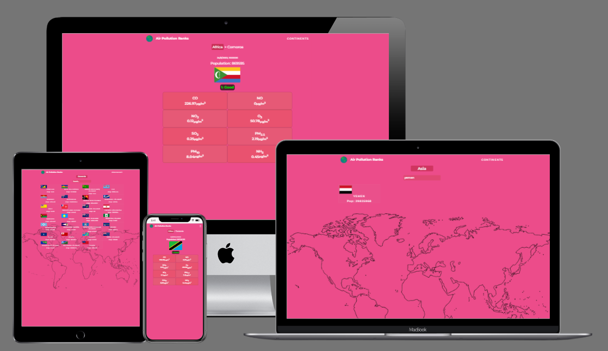

# Metrics Webapp

> This project consists of a webapp for mobile that displays real metrics from an API in single-page-app format. It uses React-Redux for all of the front-end features.


## Built With
- React & Redux
- Jest and react-testing-library
- Axios
- OpenWeatherMap's [Air Pollution API](https://openweathermap.org/api/air-pollution)
- [REST Countries API](https://restcountries.com/)
- Gitflow
- Deployed with Netlify & Heroku

## Live Demos
- [Netlify](https://strong-croquembouche-21dba9.netlify.app/)
- [Heroku](https://air-pollution-ranks.herokuapp.com/)




## Getting Started
To get a local copy up and running follow these simple example steps.

### Prerequisites
- A web browser (like Google Chrome, Opera...).
- A code editor (like Atom, VScode...).

### Setup
To setup the project locally: clone the repository using:

```
git clone git@github.com:danie12345/metrics-webapp.git
```

### Install dependencies
run : `npm install`

### Build the app
run: `npm run build`

### Run the app
run: `npm start`


## Author
**Daniel Malo**

👤 Github: [@Danie12345](https://github.com/Danie12345)

👤 LinkedIn: [daniel-malo](https://www.linkedin.com/in/daniel-malo/)

👤 Twitter: [DanielMalo_v4](https://twitter.com/DanielMalo_v4)


## 🤝 Contributing
Contributions, issues, and feature requests are welcome!

Feel free to check the [issues](https://github.com/Danie12345/metrics-webapp/issues) page.

## [Template on Behance](https://www.behance.net/gallery/31579789/Ballhead-App-%28Free-PSDs%29) by [Nelson Sakwa](https://www.behance.net/sakwadesignstudio)

## Show your support
Give a ⭐️ if you like this project!

## Acknowledgments
- Hat tip to code reviewers and to everyone who reviewed the project and made suggestions.

## 📝 License
This project is [MIT](LICENSE) licensed.
